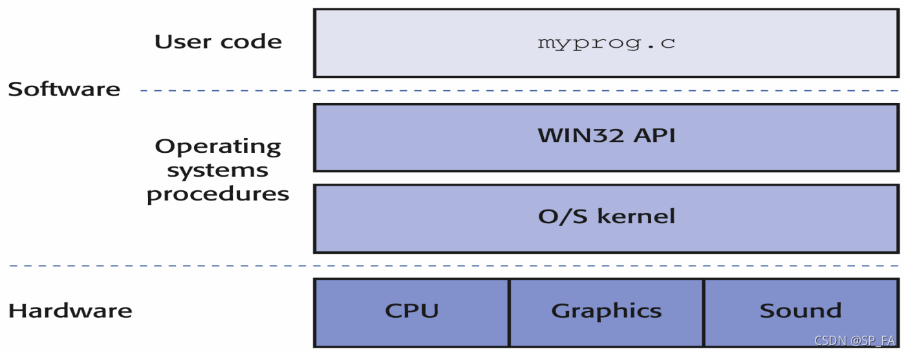
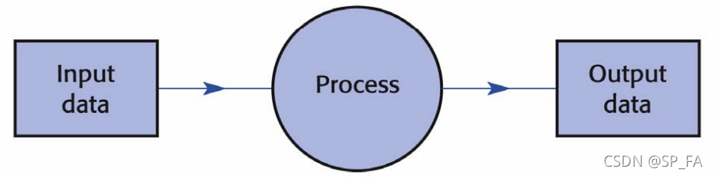
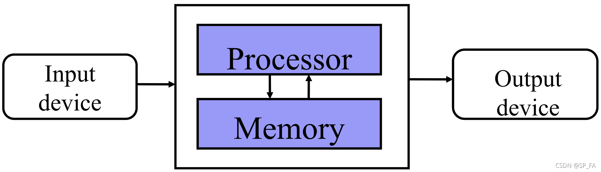
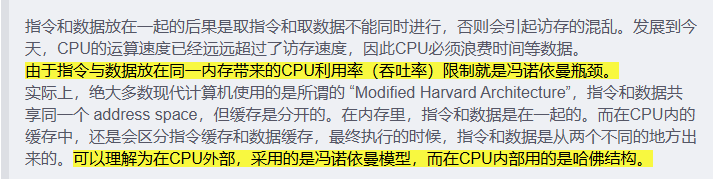
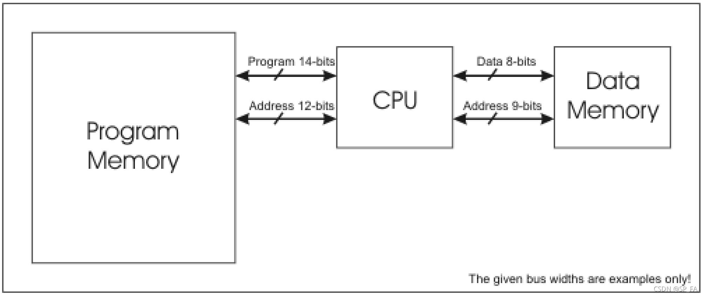

# CPT101-Computer Systems 课程笔记
         
-----

版权声明：本文为博主原创文章，遵循 CC 4.0 BY-SA 版权协议，转载请附上原文出处链接和本声明。
                        
原文链接：https://blog.csdn.net/SP_FA/article/details/120153356

-----

## 1. Overview      

*We treat Computer Systems as a study of the interaction of hardware and software which determines the performance of computer systems.*

**Four architectural levels of computer systems**
- The assembly language level
- The instruction set architecture level
- The micro architecture level
- The digital logic level     

**CPU & ALU**
- CPU : Central Processing Unit (中央处理器)
- ALU : Arithmetic and Logic Unit (算术逻辑单元) 能实现多组算术运算和逻辑运算的组合逻辑电路。是 CPU 的执行单元，是所有 CPU 的核心组成部分，主要功能是进行二元算术运算。

**The components of a computer system**
- Processors
- Controllers
- Primary memory (RAM) : 也被称为 main storage（主存），是计算机中存取速度较快的一级存储。他是唯一能被 CPU 直接访问的内存，通常被称为内存。
Secondary memory : 也被称为 auxiliary storage（辅助存储），如硬盘、U盘等等。
- Peripherals

**Types of computers**
- Mainframe computers (1960s)
- Supercomputers (1970s)
- Microcomputers (1980s)
- Workstations (1980s)
- Personal computers (1980s)
- Microcontrollers (单片机) (1980s)
- Servers (1980s)
- Chip computer

**Computer generations**
- Vacuum tube (电子管) (1944 ~ 1958) : [推荐文章](https://zhuanlan.zhihu.com/p/144678115)
- Transistor (晶体管) (1959 ~ 1963)
- IC (Integrated Circuit 集成电路) (1964 ~ 1970)
- VLSI (Very Large Scale Integration 超大规模集成电路) (1970 ~ now)

**Backward (Downward) Compatibility for new hardware (向后/向下兼容)**     
Most software written for computers with old hardware can be run on computers with newer hardware.

**VHDL (硬件描述语言)**

- Very high speed integrated circuits Hardware Description Language.
- A programming language to be used to specify both the structure and function of hardware circuits.
- Supports computer simulations as well as providing input to automatic layout packages which arranges the final circuits.

**Hierarchy of systems**       
Computers can always be viewed as hierarchical ordered systems which can be broken down into simple component parts in order to fully understand their operations.

**Moore’s Law**

The amount of circuitry (number of transistors) which can be placed on a given chip area approximately doubles every two years.

**Windowing interfaces ---- WIMPs**
A by-product of the microprocessor revolution, which allowed all users to have fast bitmapped graphics on their desks.

**Trends of computing**
- Scientific computing : Computation
- Business computing : Data
- Personal computing : Interaction
- Pervasive computing : Ubiquity
- Mobile computing : Mobility

## 2. I-O Process
### 2.1 Input-Process-Output Model

- The Input-Process-Output Model is the fundamental structure of the current generation of digital computers.
- This was an essential scheme of the von Neumann model.
- There are three components required for the implementation of Input-Process-Output and von Neumann models:
    - Hardware
    - Software
    - Data that is being manipulated

### 2.2 Von Neumann Model
**John Von Neumann**
An Austria-Hungary-born American mathematician. Made contributions to: quantum physics, functional analysis, set theory, topology, economics, computer science, numerical analysis, hydrodynamics.

- The computer is a general-purpose machine controlled by an executable program.
- A program is a list of instructions used to direct a task.
- Both program and data are held in computer’s memory and both represented by binary codes.
- The fact that **memory is re-writeable** makes a von Neumann machine especially powerful.
- A processor is an active part of the machine that executes the program instructions.

**Von Neumann bottleneck**
CPU is continuously forced to wait for vital data (and instructions) to be transferred to or from memory.

[原文链接](https://blog.csdn.net/guojunxiu/article/details/79942905)

### 2.3 Harvard architecture

- Separates data from programs.
- Requires different memories and access buses for programs and data.

[为什么电脑还沿用冯·诺伊曼结构而不使用哈佛结构](https://www.zhihu.com/question/22406681)
